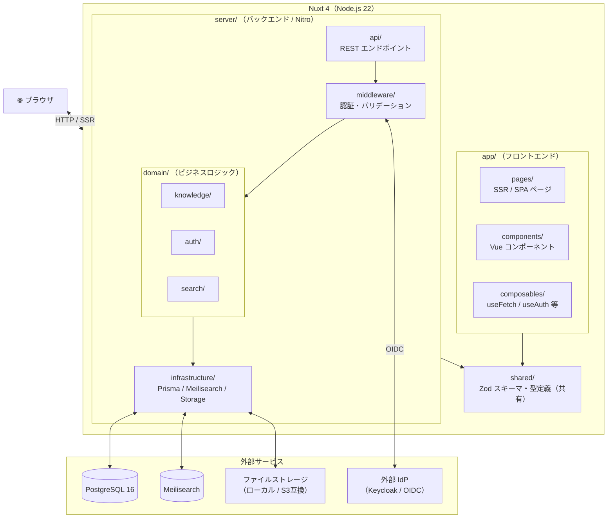

# アーキテクチャ設計

> 新システム（Nuxt 4 版 knowledge）のアーキテクチャ方針をまとめる。
> 技術選定の根拠は各 ADR に委譲し、ここでは **構造・設計方針・開発スタイル** を定義する。

## Links

- [[ADR-001_framework]] - Nuxt 4 フルスタック採用
- [[ADR-002_search]] - Meilisearch 採用
- [[feature_scope]] - 機能スコープ
- [[current-system/01_architecture]] - 移行元システムのアーキテクチャ

---

## 1. 全体構成

### アーキテクチャスタイル：Modular Monolith

単一の Nuxt 4 アプリケーションとして構築する。
サービス分割（マイクロサービス化）は行わない。

**選択理由：**

- チーム規模・開発初期フェーズではオーバーエンジニアリングになる
- Nuxt 4 フルスタック構成（`server/` + `app/`）が Modular Monolith に自然に対応する
- 将来的に特定ドメインを切り出す必要が生じた場合、モジュール境界が明確であれば分離しやすい

### システム構成図



---

## 2. ディレクトリ構造

```
knowledge/                         # リポジトリルート
├── app/                           # フロントエンド（Nuxt 4 規約）
│   ├── pages/                     # ファイルベースルーティング
│   ├── components/
│   │   ├── common/                # 汎用UIコンポーネント
│   │   └── knowledge/             # ドメイン別コンポーネント
│   ├── composables/               # useFetch ラッパー・状態管理
│   └── layouts/
│
├── server/                        # バックエンド（Nitro）
│   ├── api/                       # エンドポイント定義（薄い層）
│   │   ├── knowledge/
│   │   ├── auth/
│   │   └── search/
│   ├── middleware/                # リクエスト共通処理（認証・ログ等）
│   ├── domain/                    # ビジネスロジック（コアドメイン）
│   │   ├── knowledge/
│   │   │   ├── KnowledgeService.ts
│   │   │   └── KnowledgeRepository.ts  # インターフェース定義
│   │   ├── auth/
│   │   └── search/
│   └── infrastructure/            # 技術的関心（DB・外部API）
│       ├── prisma/                # PrismaClient ラッパー
│       ├── meilisearch/           # Meilisearch クライアント
│       └── storage/               # ファイルストレージ抽象
│
├── shared/                        # フロント・バック共有
│   ├── schemas/                   # Zod スキーマ（バリデーション＋型生成）
│   └── types/                     # 共有型定義
│
├── prisma/
│   ├── schema.prisma
│   └── migrations/
│
└── tests/
    ├── unit/                      # ドメインロジックの単体テスト
    ├── integration/               # DB / 外部サービスを含む結合テスト
    └── e2e/                       # Playwright による E2E テスト
```

---

## 3. レイヤー設計

DDD の考え方を **軽量に** 取り入れる。
厳格な DDD（集約・ドメインイベント等）は現段階では採用しない。

| レイヤー | 場所 | 責務 | 依存方向 |
|---------|------|------|---------|
| **Presentation** | `server/api/` `app/pages/` | リクエスト受付・レスポンス整形 | → Application |
| **Application** | `server/domain/*/Service.ts` | ユースケース実装・トランザクション制御 | → Domain / Infra |
| **Domain** | `server/domain/*/` | ビジネスルール・エンティティ・インターフェース | 外部に依存しない |
| **Infrastructure** | `server/infrastructure/` | DB・外部API の具体実装 | → Domain（インターフェース実装） |

### 依存の方向

```
Presentation → Application → Domain ← Infrastructure
```

- `domain/` は Prisma・Meilisearch を直接 import しない
- `infrastructure/` が `domain/` のリポジトリインターフェースを実装する
- この分離により、ドメインロジックのユニットテストが DB なしで書ける

---

## 4. 型・バリデーション戦略

`shared/schemas/` の Zod スキーマを **唯一の真実（Single Source of Truth）** とする。

```
shared/schemas/knowledge.ts
  └── KnowledgeCreateSchema (Zod)
        ├── → TypeScript 型（z.infer<>）をフロント・バック両方で共有
        ├── → server/api/ でリクエストバリデーション
        └── → app/composables/ でフォームバリデーション

prisma/schema.prisma
  └── DB スキーマ（永続化層の責任）
        └── Zod スキーマと役割を明確に分離
            ※ Prisma の型をそのまま API レスポンスに使わない
```

---

## 5. 開発スタイル

### TDD（テスト駆動開発）

- **ドメインロジック**（`server/domain/`）は TDD で実装する
- ユニットテストは DB・外部サービスに依存しないこと（Repository はモックする）
- API エンドポイントは Integration テストで検証する
- UI コンポーネントは必須ではないが、重要なものは Vitest でテストする

### テストの種類と方針

| 種別 | ツール | 対象 | 方針 |
|------|--------|------|------|
| Unit | Vitest | `domain/` | TDD。外部依存なし |
| Integration | Vitest | `server/api/` | テスト用 DB（Docker）を使用 |
| E2E | Playwright | 主要フロー | CI で実行。スモークテスト中心 |

### コード品質

| ツール | 用途 |
|--------|------|
| ESLint + `@nuxt/eslint` | Lint（Nuxt 公式設定） |
| Prettier | フォーマット |
| TypeScript strict mode | 型安全性の担保 |
| Husky + lint-staged | コミット前チェック |

---

## 6. 非機能方針（概要）

詳細は各 ADR・専用ドキュメントに委譲する。

| 関心 | 方針 | 参照 |
|------|------|------|
| 認証 | better-auth（組み込み）または Keycloak OIDC | [[ADR-005_auth]] |
| ファイルストレージ | ローカル FS または S3 互換（設定で切替） | [[ADR-006_file_storage]] |
| 全文検索 | Meilisearch（スコープ確定後に PG 全文検索と再評価） | [[ADR-003_search]] |
| ランタイム | Node.js 22 LTS | [[ADR-007_runtime]] |
| コンテナ | Docker Compose（開発・本番ともに） | `docker-compose.yml` |

---

## 7. 移行方針（旧システムとの対比）

| 観点 | 旧システム | 新システム |
|------|-----------|-----------|
| フレームワーク | カスタム実装 | Nuxt 4（標準的） |
| レイヤー構成 | Filter → Logic → DAO（カスタム） | Presentation → Domain → Infra（標準的） |
| ORM | カスタム XML マッピング | Prisma |
| 型安全性 | なし（Java は型あり・TS 側なし） | Zod + TypeScript strict |
| テスト | 不明（旧システムにテストなし） | TDD（ドメイン層） + E2E |
| デプロイ | WAR（Tomcat） | Docker コンテナ |
