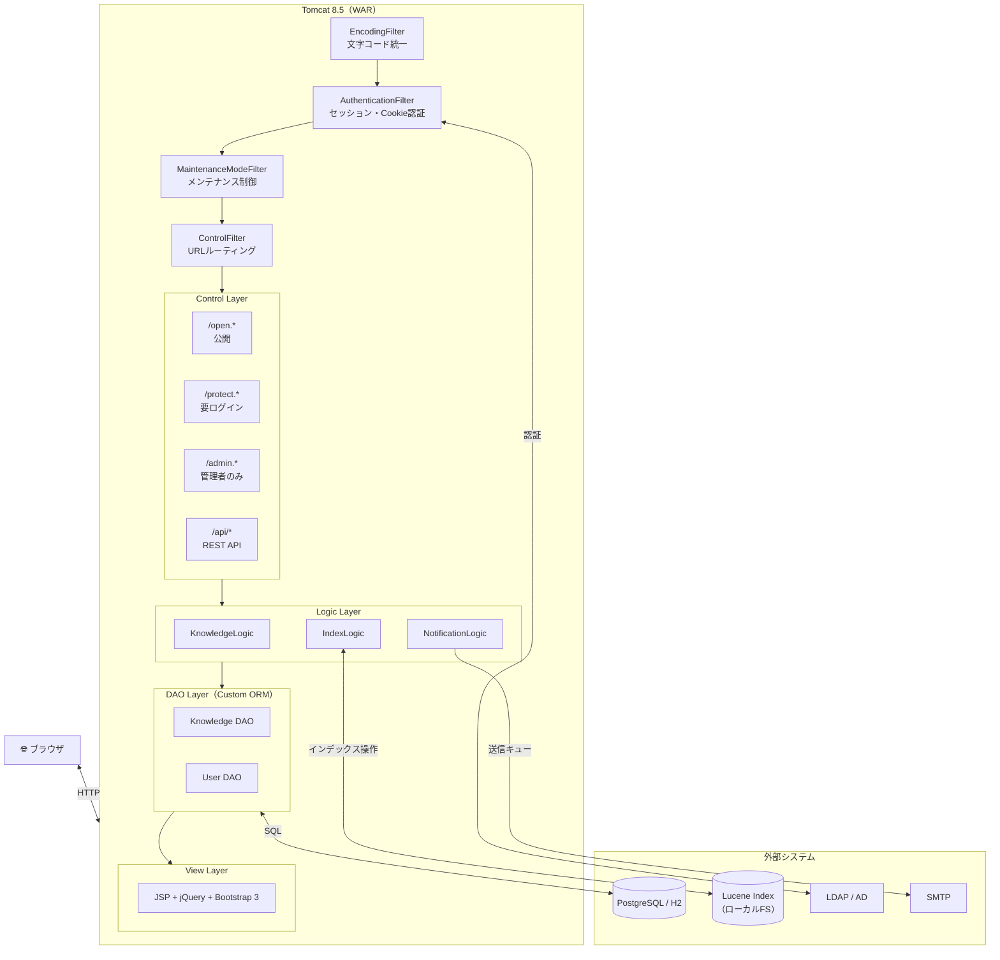
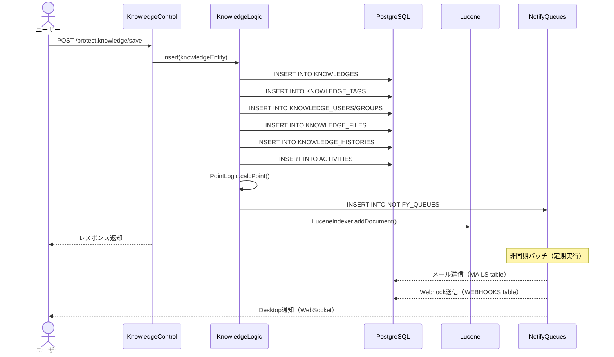
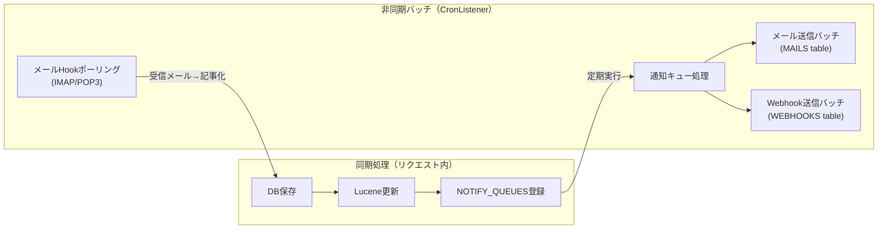

# アーキテクチャ概要

旧システム（Java版knowledge）は、カスタムフレームワーク上に構築されたモノリシックなWebアプリケーションである。
Spring BootのようなDIフレームワークやORMを使わず、DI・ORM・ルーティングをすべて自前実装しているため、
外部ドキュメントが存在せず保守コストが非常に高い。

## Links

- [[00_current_system_analysis]] - 現状解析サマリ
- [[02_domain_model]] - エンティティ・DB設計
- [[03_api_endpoints]] - コントローラ・エンドポイント一覧
- [[05_auth_security]] - 認証・認可詳細

---

## システム構成図

Tomcat上で動作するWARファイルをデプロイする構成。
リクエストはServlet Filterのチェーンを通過してからコントローラに到達する。
認証・認可・ルーティングはすべてFilterレイヤーが担っており、Spring SecurityやJAX-RSのような標準的な仕組みを使っていない点が移行時の課題となる。

---

## レイヤー設計

このシステムは4層構造を持つ。各層の責務は明確だが、すべてカスタム実装であるため標準的なフレームワークの恩恵を受けられない。

### Filter Layer（リクエスト前処理）

8本のFilterが順番に実行される。特に `AuthenticationFilter` と `ControlFilter` が中核を担う。
`AuthenticationFilter` はURLパターンで認証スキップを判定し、セッションまたはCookieで認証状態を復元する。
`ControlFilter` はURL規則（`/スコープ.クラス名/メソッド名`）に基づいてコントローラクラスをリフレクションで呼び出す。

| フィルター | 役割 |
|----------|------|
| EncodingFilter | 文字コードをUTF-8に統一 |
| SeqFilter | リクエストごとにシーケンスIDを付与 |
| LoggingFilter | アクセスログ記録 |
| ApiFilter | APIリクエストの前処理 |
| AuthenticationFilter | セッション認証・Cookie認証 |
| MultipartFilter | ファイルアップロード（マルチパート解析） |
| MaintenanceModeFilter | メンテナンス中はアクセスをブロック |
| ControlFilter | URLをコントローラクラス・メソッドにマッピング |

### Control Layer（HTTPハンドラ）

URLのスコーププレフィックスでアクセスレベルを表現している。同一クラスをopenとprotectで別スコープに配置することで公開/非公開を切り替えている。

| スコープ | 認証 | 例 |
|---------|------|---|
| `open` | 不要 | `/open.knowledge/list` |
| `protect` | ログイン必須 | `/protect.knowledge/save` |
| `admin` | 管理者ロール必須 | `/admin.users/list` |
| `api` | APIトークン | `/api/knowledges` |

### Logic Layer（ビジネスロジック）

ビジネスロジックは専用のLogicクラスに集約されている。`KnowledgeLogic` が最も肥大化しており、記事のCRUD・コメント・Like・差分計算・通知キュー登録・Luceneインデックス更新をすべて担う。

| クラス | 役割 |
|-------|------|
| KnowledgeLogic | 記事のCRUD、コメント、Like、差分計算 |
| NotifyLogic | 通知キューへの登録（非同期） |
| NotificationLogic | 通知の配信（メール・Webhook・Desktop） |
| IndexLogic | Luceneインデックスの更新・検索 |
| LdapLogic | LDAP認証 |
| MarkdownLogic | Markdown→HTML変換（MarkedJカスタムfork） |
| SanitizingLogic | XSS防止のHTMLサニタイズ（OWASP） |
| PointLogic | ポイント計算・バッジ付与 |

### DAO Layer（データアクセス）

各エンティティに `Gen*Dao`（コード自動生成）と `*Dao`（拡張用）のペアが存在する。
SQLはXMLに定義されておりMyBatis風だが完全な独自実装のため、N+1問題等のデバッグが困難。

---

## 記事投稿のデータフロー

一つのリクエストでDB保存・インデックス更新・通知キュー登録が同期的に実行される。
通知の実際の配信（メール・Webhook）は非同期バッチで別途処理される。

---

## 非同期処理アーキテクチャ

通知・メール・Webhookは即時処理ではなくキューを介した非同期処理になっている。
これによりリクエストのレスポンスを早めているが、バッチが失敗しても呼び出し元にフィードバックされない設計上の問題もある。

---

## 技術スタック一覧

旧システムの主要技術とバージョン。大半が2014〜2017年代のもので、現在のエコシステムと大きく乖離している。

| レイヤー | 技術 | バージョン | 備考 |
|---------|------|----------|------|
| コンテナ | Tomcat | 8.5.91 | |
| 言語 | Java | 1.8（実行: 11+） | Java 21 LTSと2世代差 |
| Webフレームワーク | カスタム（Servlet 3.1） | - | 情報ゼロ・保守不能 |
| DI | カスタム（@DIアノテーション） | - | 同上 |
| ORM | カスタム（XML SQLマッピング） | - | 同上 |
| DB (開発) | H2 | 1.4.196 | |
| DB (本番) | PostgreSQL | 42.1.4ドライバ | |
| 全文検索 | Lucene + kuromoji | **4.10.4** | 2014年。現在は9.x |
| Markdown変換 | MarkedJ（カスタムfork） | 1.6.0 | |
| HTMLサニタイズ | OWASP HTML Sanitizer | 20171016.1 | |
| UIフレームワーク | Bootstrap | **3.3.6** | 2016年。現在は5.x |
| JS | jQuery | **2.2.3** | EOL |
| リアクティブ | Vue.js | **2.4.2** | EOL |
| ビルド | Maven + Gulp 4 + **Bower** | - | Bower廃止済み |
