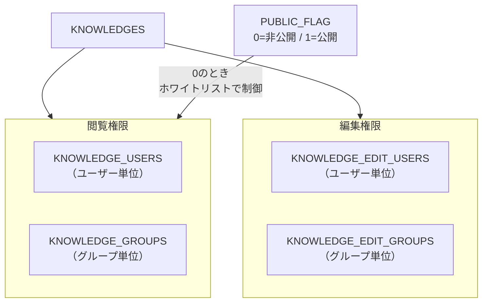
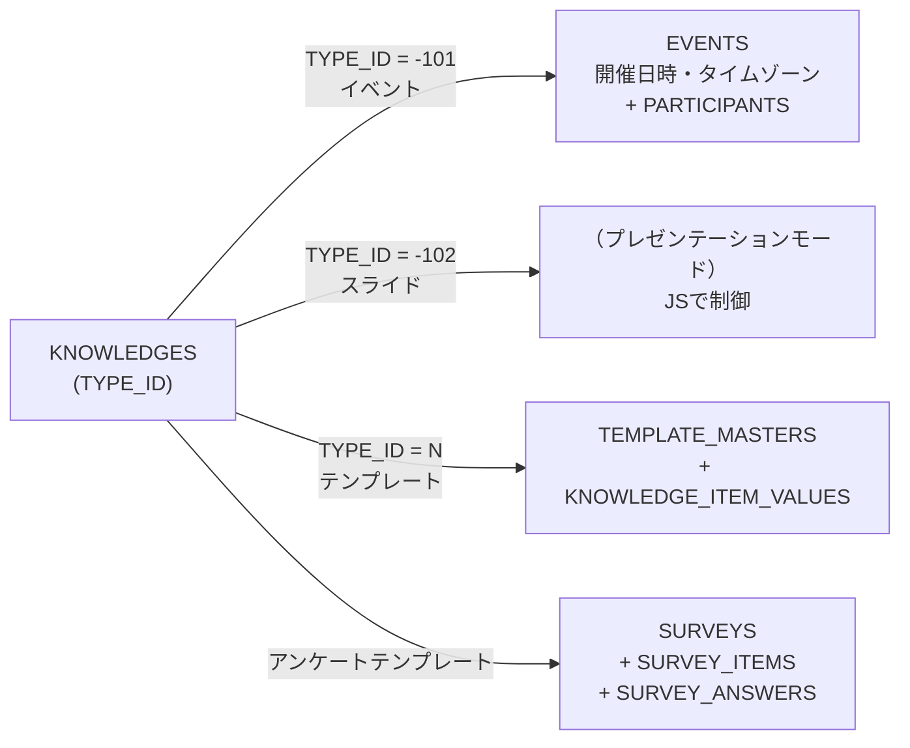

# ドメインモデル・DBスキーマ解析

旧システムのDBは `web` モジュール（認証・共通）と `knowledge` モジュール（コアドメイン）の2つのDDLファイルに分かれており、合計78テーブルに及ぶ。
機能追加を繰り返した結果、テーブルが肥大化しており、リライトでは全テーブルの移行は行わない。
スコープ確定後、必要なテーブルのみPrismaスキーマとして再設計する。

## Links

- [[00_current_system_analysis]] - 現状解析サマリ
- [[01_architecture]] - アーキテクチャ概要
- [[05_auth_security]] - 認証・認可

---

## テーブル数サマリ

| モジュール | テーブル数 | 概要 |
|----------|---------|------|
| web（認証・認可・共通） | 27 | ユーザー・ロール・グループ・設定・メールキュー |
| knowledge（コアドメイン） | 51 | 記事・コメント・タグ・通知・Webhook・ゲーミフィケーション |
| **合計** | **78** | |

---

## コアドメインのER図

記事（KNOWLEDGES）を中心に、コメント・タグ・ユーザー・グループが放射状に接続する構造。
アクセス制御は「閲覧権限」と「編集権限」の2系統をユーザー単位・グループ単位でそれぞれ持つため、4つのジャンクションテーブルが必要になっている。

```mermaid
erDiagram
    USERS ||--o{ USER_ROLES : "持つ"
    USERS ||--o{ USER_GROUPS : "所属"
    USERS ||--|| NOTIFY_CONFIGS : "通知設定"
    ROLES ||--o{ USER_ROLES : ""
    ROLES ||--o{ ROLE_FUNCTIONS : ""
    FUNCTIONS ||--o{ ROLE_FUNCTIONS : ""
    GROUPS ||--o{ USER_GROUPS : ""
    GROUPS ||--o{ KNOWLEDGE_GROUPS : ""

    KNOWLEDGES ||--o{ COMMENTS : "持つ"
    KNOWLEDGES ||--o{ LIKES : "持つ"
    KNOWLEDGES ||--o{ KNOWLEDGE_TAGS : ""
    KNOWLEDGES ||--o{ KNOWLEDGE_USERS : "閲覧権限"
    KNOWLEDGES ||--o{ KNOWLEDGE_GROUPS : "閲覧権限"
    KNOWLEDGES ||--o{ KNOWLEDGE_EDIT_USERS : "編集権限"
    KNOWLEDGES ||--o{ KNOWLEDGE_HISTORIES : "バージョン履歴"
    KNOWLEDGES ||--o{ KNOWLEDGE_FILES : "添付ファイル"
    KNOWLEDGES |o--|| EVENTS : "イベント種別"
    KNOWLEDGES |o--|| SURVEYS : "アンケート種別"
    KNOWLEDGES ||--o{ STOCK_KNOWLEDGES : ""

    TAGS ||--o{ KNOWLEDGE_TAGS : ""
    STOCKS ||--o{ STOCK_KNOWLEDGES : ""
    COMMENTS ||--o{ LIKE_COMMENTS : ""
    COMMENTS ||--o{ KNOWLEDGE_FILES : "添付"

    EVENTS ||--o{ PARTICIPANTS : ""
    USERS ||--o{ PARTICIPANTS : ""
    USERS ||--o{ KNOWLEDGE_EDIT_USERS : ""
    USERS ||--o{ KNOWLEDGE_USERS : ""
    USERS ||--o{ LIKES : ""
    USERS ||--o{ COMMENTS : ""
```



---

## webモジュール（認証・認可・共通）

### ユーザー・グループ・ロール

認証と認可の中核となる3エンティティ。ロールは機能単位（FUNCTIONS）にマッピングされ、URLレベルのアクセス制御に使われる。

```
USERS
  ├─ USER_KEY   ログインID（メールアドレス等）
  ├─ PASSWORD   ハッシュ（不可逆・PBKDF2-like）
  ├─ SALT       ユーザー別ランダムソルト
  ├─ AUTH_LDAP  0=DB認証 / 1=LDAP認証
  └─ DELETE_FLAG 論理削除

GROUPS（階層構造）
  └─ PARENT_GROUP_KEY  自己参照で親グループを指定

ROLES → ROLE_FUNCTIONS → FUNCTIONS
  URLパスパターンとロールIDのマッピングで機能単位のアクセス制御
```

### 認証補助テーブル

登録・パスワードリセット・メールアドレス変更のそれぞれにトークンテーブルが存在する。いずれも有効期限付きのワンタイムトークンで運用される。

| テーブル | 用途 |
|---------|------|
| LOGIN_HISTORIES | ログイン日時・IP・UA記録（セキュリティ監査） |
| PROVISIONAL_REGISTRATIONS | 仮登録（メール認証待ちユーザー） |
| PASSWORD_RESETS | パスワードリセット用トークン |
| CONFIRM_MAIL_CHANGES | メールアドレス変更確認トークン |
| USER_ALIAS | OAuthなど外部認証のエイリアス管理 |
| TOKENS | REST API用の個人トークン（有効期限付き） |

### 設定テーブル

システム設定をキーバリュー形式でDBに持つ設計。環境変数やファイルではなくDB管理することで管理画面から動的に変更できる反面、スキーマが緩く型安全性がない。

| テーブル | 用途 |
|---------|------|
| SYSTEM_CONFIGS | グローバル設定（KV形式・VARCHAR） |
| SYSTEM_ATTRIBUTES | グローバル属性（KV形式・TEXT） |
| USER_CONFIGS | ユーザー別設定（KV形式） |
| HASH_CONFIGS | パスワードハッシュのパラメータ |
| LDAP_CONFIGS | LDAP接続設定（パスワードはAES暗号化） |
| PROXY_CONFIGS | プロキシ設定 |
| MAIL_CONFIGS | SMTPサーバー設定 |

---

## knowledgeモジュール（コアドメイン）

### KNOWLEDGES（記事 - 中心エンティティ）

記事は最も多くのテーブルと関連するコアエンティティ。
パフォーマンスのために `LIKE_COUNT / COMMENT_COUNT / VIEW_COUNT / TAG_NAMES` を非正規化カウンタとして保持しており、更新時に整合性を保つ必要がある。

```
KNOWLEDGES
  ├─ TITLE          VARCHAR(1024)
  ├─ CONTENT        TEXT              Markdown本文
  ├─ PUBLIC_FLAG    INTEGER           0=非公開 / 1=公開
  ├─ TAG_IDS        VARCHAR(1024)     カンマ区切り（非正規化）
  ├─ TAG_NAMES      TEXT              カンマ区切り（非正規化）
  ├─ LIKE_COUNT     BIGINT            ※非正規化カウンタ
  ├─ COMMENT_COUNT  INTEGER           ※非正規化カウンタ
  ├─ VIEW_COUNT     BIGINT            ※非正規化カウンタ
  ├─ TYPE_ID        INTEGER           テンプレート種別（FK→TEMPLATE_MASTERS）
  ├─ POINT          INTEGER           記事ポイント
  └─ ANONYMOUS      INTEGER           0=記名 / 1=匿名投稿
```

### アクセス制御の構造

公開フラグとユーザー/グループ単位のホワイトリストを組み合わせてアクセス制御する。
閲覧権限と編集権限が独立しているため、4つのジャンクションテーブルが必要になっている。



### ファイル添付

添付ファイルは `FILE_BINARY BYTEA` としてDBに直接保存される設計。記事・コメント・下書きのいずれにも紐付けられるよう nullable な外部キーで設計されているが、DBの肥大化リスクが高い。

```
KNOWLEDGE_FILES
  ├─ KNOWLEDGE_ID  nullable  記事への添付
  ├─ COMMENT_NO    nullable  コメントへの添付
  ├─ DRAFT_ID      nullable  下書きへの添付
  ├─ FILE_BINARY   BYTEA     ← DBにバイナリ直接保存
  └─ PARSE_STATUS  INTEGER   Tikaによる解析状態（未/済/エラー）
```

### 特殊種別の記事（TYPE_IDによる分岐）

記事はテンプレートIDによって通常記事・イベント・アンケートに分岐する。
EventsとSurveysは `KNOWLEDGE_ID` をPKとする1:1の拡張テーブルで実装されている。



### テンプレートシステム

フォームの項目定義をDBに持ち、記事投稿時に動的フォームを生成する機能。

```
TEMPLATE_MASTERS  （テンプレート定義）
  └─ 1:N TEMPLATE_ITEMS  （フィールド定義）
           └─ 1:N ITEM_CHOICES  （選択肢）

KNOWLEDGE_ITEM_VALUES  （実データ）
DRAFT_ITEM_VALUES      （下書きデータ）
```

### ゲーミフィケーション

ポイントはユーザー・記事それぞれに台帳形式で記録される。バッジの獲得条件はポイント閾値で定義される。

```
BADGES（バッジ定義）  POINT閾値で達成条件を表現
  └─ USER_BADGES（ユーザー獲得バッジ）

ACTIVITIES（行動ログ）  USER_ID + KIND + TARGET（汎用参照）
  ├─ POINT_USER_HISTORIES     ← ユーザーポイント台帳（不変）
  └─ POINT_KNOWLEDGE_HISTORIES ← 記事ポイント台帳（不変）
```

---

## 設計パターンのポイント

全テーブルに共通する設計上の特徴をまとめる。リライト時は論理削除・監査カラム・Blob保存について再設計が必要。

| パターン | 内容 | 移行時の方針 |
|---------|------|------------|
| **論理削除** | 全テーブルに `DELETE_FLAG` | Prismaでソフトデリートを検討 |
| **監査カラム** | 全テーブルに `INSERT_USER/DATETIME`, `UPDATE_USER/DATETIME` | Prismaミドルウェアで自動化 |
| **非正規化カウンタ** | `LIKE_COUNT / COMMENT_COUNT / VIEW_COUNT / TAG_NAMES` | `_count` クエリで都度集計に変更も可 |
| **不変台帳** | `KNOWLEDGE_HISTORIES`, `POINT_*_HISTORIES` は追記のみ | 同様の設計を踏襲 |
| **汎用参照** | `ACTIVITIES.TARGET` はID文字列で任意エンティティを参照 | 型安全な参照方式に変更 |
| **DBへのBlobストレージ** | ファイル・アバターを `BYTEA` でDB内に保存 | S3互換ストレージ（MinIO等）に移行 |
| **KV設定** | `SYSTEM_CONFIGS / USER_CONFIGS` はキーバリュー形式 | 構造化した設定テーブルに変更 |
