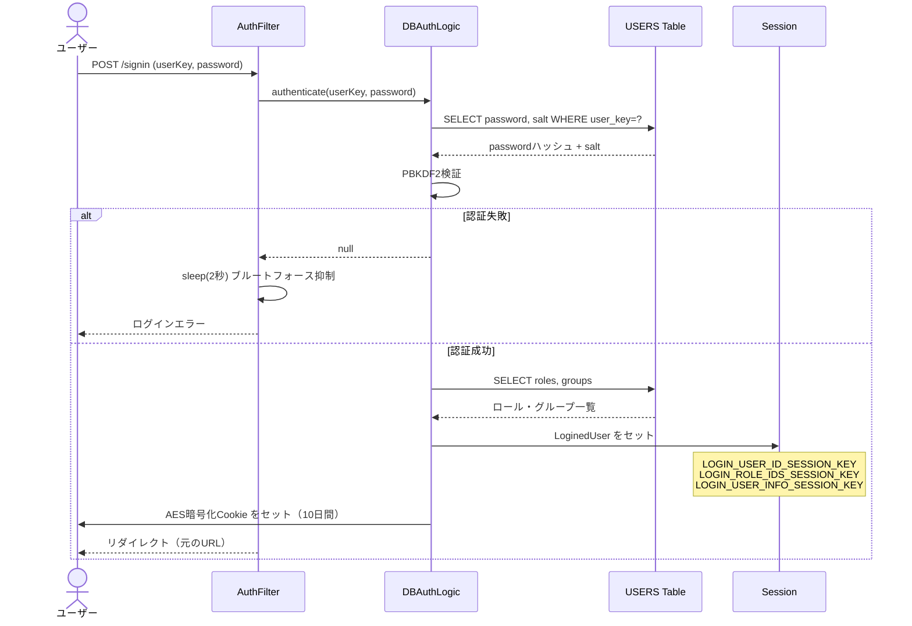
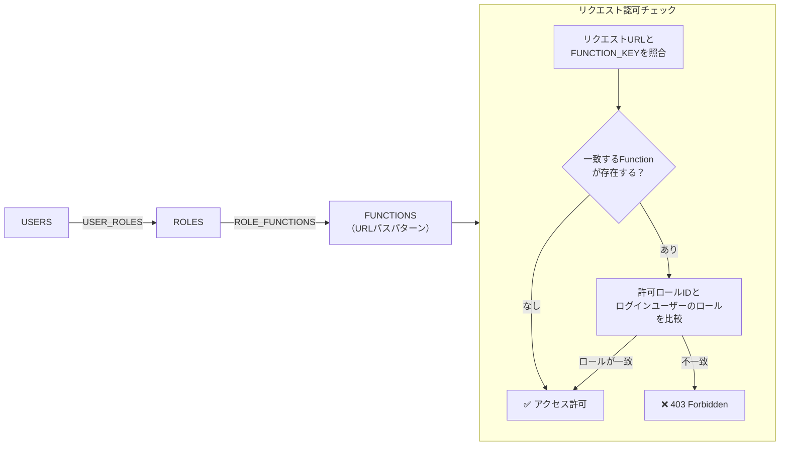
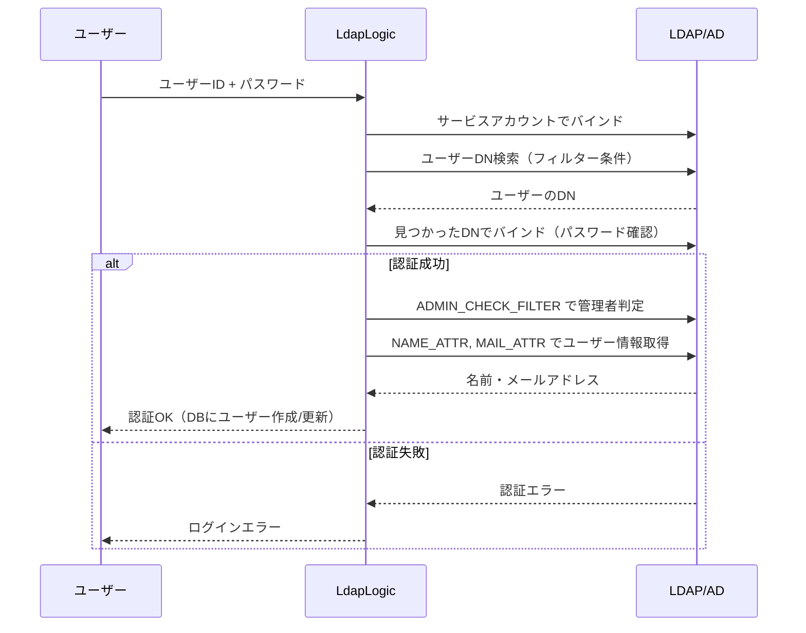
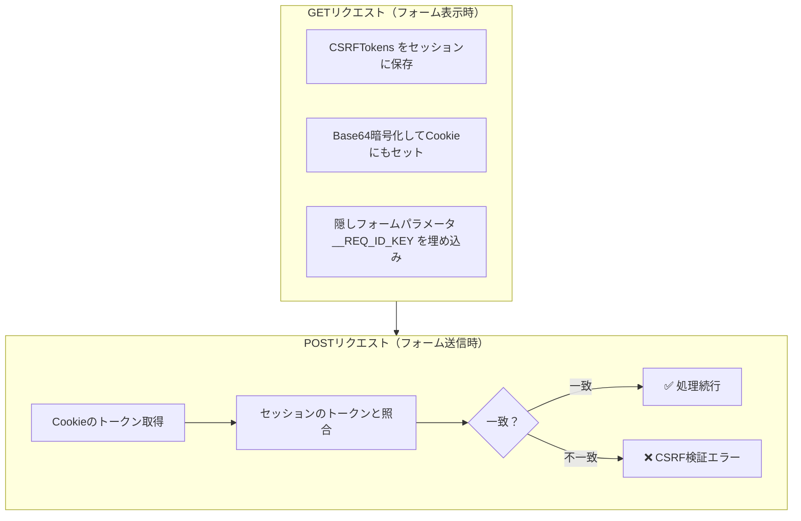

# 認証・認可・セキュリティ解析

認証・認可はSpring Securityのような標準フレームワークを使わず、カスタムのFilterとLogicクラスで実装されている。
セッションベースの認証を基本とし、Cookie暗号化によるリメンバーミー機能を持つ。
RBACは「ロール→機能」の2段マッピングで実現されており、DB管理されているため管理画面から動的に変更できる。

## Links

- [[00_current_system_analysis]] - 現状解析サマリ
- [[01_architecture]] - アーキテクチャ概要
- [[02_domain_model]] - 関連テーブル（USERS, ROLES, FUNCTIONS等）

---

## 認証フロー

ログイン失敗時に2秒の強制スリープを入れることでブルートフォース攻撃を抑制している。
認証成功後はユーザー情報・ロール・グループを一括でSessionに保存し、以降のリクエストはSessionから復元する。



### セッションの内容

`LoginedUser` オブジェクトには認証後に必要な情報をすべて詰め込んでいる。これにより各リクエストでDB問い合わせを省くが、グループやロールが変更されてもセッションが切れるまで反映されない問題がある。

```
LoginedUser（Session保存オブジェクト）
  ├─ UsersEntity     ユーザーID・Key・Name・Mail等
  ├─ List<Roles>     グローバルロール一覧
  ├─ List<Groups>    所属グループ一覧
  └─ Locale          言語設定
```

### Cookie認証（リメンバーミー）

セッションが切れた際のフォールバックとして動作する。内容はAES暗号化されているため平文では保存されないが、キーが漏洩すると任意のユーザーとしてログインできる点は注意が必要。

| 項目 | 設定値 |
|------|--------|
| Cookie名 | `LOGIN_USER_KEY` |
| 内容 | `UserSecret { userKey, userName, email }` をAES暗号化 |
| Max-Age | 10日 |
| 暗号化キー | アプリ起動時に24文字ランダム生成 |

---

## パスワード管理

パスワードはユーザーごとにランダムソルトを生成し、PBKDF2-likeのハッシュで保存する。
反復回数・ビット数は `HASH_CONFIGS` テーブルで管理されているため、管理画面から変更可能。

| 項目 | 詳細 |
|------|------|
| ハッシュ方式 | PBKDF2-like（反復回数・ビット数はHASH_CONFIGSで設定） |
| ソルト | ユーザー別にランダム生成、USERSテーブルのSALTカラムに保存 |
| 可逆暗号化（設定値） | LDAP_CONFIGS, PROXY_CONFIGS, MAIL_CONFIGSのパスワードはAES暗号化 |

---

## RBAC（ロールベースアクセス制御）

3層構造でURLレベルのアクセス制御を実現している。機能とロールのマッピングはDB管理なので、コード変更なく権限設定を変更できる点は利点。



### 記事レベルのアクセス制御

グローバルなRBACとは別に、記事単位でユーザー・グループへの閲覧/編集権限を設定できる。Lucene検索時にもこのアクセス制御がクエリに組み込まれ、権限のない記事は検索結果に現れない。

| テーブル | 用途 |
|---------|------|
| KNOWLEDGE_USERS | 閲覧可能ユーザー |
| KNOWLEDGE_GROUPS | 閲覧可能グループ |
| KNOWLEDGE_EDIT_USERS | 編集可能ユーザー |
| KNOWLEDGE_EDIT_GROUPS | 編集可能グループ |

---

## LDAP認証

企業内Active DirectoryとのSSO連携機能。`AUTH_TYPE` で「DBのみ」「LDAPのみ」「DB+LDAPフォールバック」を切り替えられる。



### LDAP設定項目

| 項目 | 説明 |
|------|------|
| HOST / PORT | LDAPサーバー（389=LDAP, 636=LDAPS） |
| USE_SSL / USE_TLS | セキュア接続フラグ |
| BIND_DN / BIND_PASSWORD | サービスアカウント（AES暗号化保存） |
| BASE_DN | ユーザー検索のベースDN |
| FILTER | ユーザー検索フィルター（例: `(uid={userid})`） |
| ID_ATTR | ログインID属性（例: `uid`, `sAMAccountName`） |
| ADMIN_CHECK_FILTER | 管理者昇格判定フィルター |

---

## CSRF保護

二重Cookie検証パターンを採用している。セッション側とCookie側の両方にトークンを保存し、POSTリクエスト時に照合する。加えて隠しフォームパラメータによる第二の検証も可能。



コントローラのアノテーションで検証レベルを細かく設定できる：

```java
@Post(
    subscribeToken = "knowledge",  // CSRF検証有効
    checkReferer   = true,         // Refererヘッダ確認
    checkReqToken  = true          // 隠しパラメータも検証
)
```

---

## セキュリティ対策まとめ

旧システムは標準フレームワークを使わない分、個別実装のリスクはあるが基本的なセキュリティ対策は網羅している。

| 脅威 | 対策 | 実装 |
|------|------|------|
| パスワード漏洩 | PBKDF2-likeハッシュ + ユーザー別ソルト | `PasswordUtil` |
| ブルートフォース | ログイン失敗時2秒スリープ | `AuthenticationFilter` |
| CSRF | 二重Cookieパターン + 隠しパラメータ | `HttpRequestCheckLogic` |
| XSS | OWASPサニタイザーでMarkdown出力をサニタイズ | `SanitizingLogic` |
| 機密設定の平文保存 | LDAP/SMTP/ProxyパスワードはAES暗号化 | 各ConfigsEntity |
| セッション固定 | ログイン時にセッションIDを再生成 | `AbstractAuthenticationLogic` |
