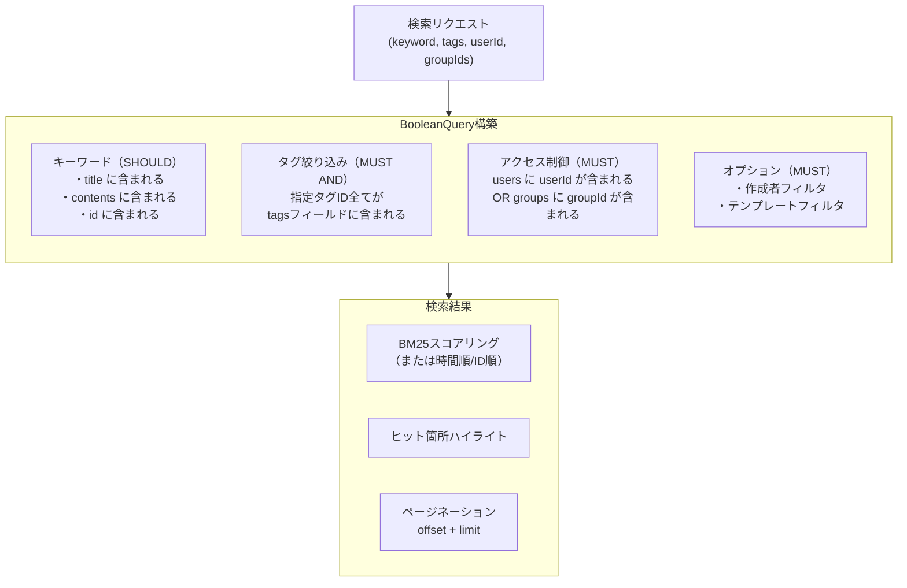
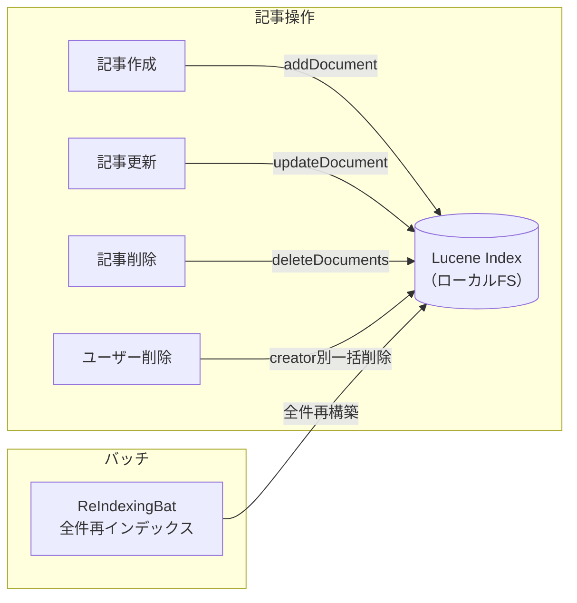

# 全文検索システム解析（Lucene）

旧システムの全文検索はApache Lucene 4.10をベースに自前実装されており、日本語の形態素解析にkuromojiを使用している。
検索インデックスはローカルファイルシステムに保存するため、複数サーバーへのスケールアウトができない構造になっている。
また Lucene 4.10 は 2014年リリースであり、現在の最新版（9.x）とはAPIが大幅に異なる。

## Links

- [[00_current_system_analysis]] - 現状解析サマリ
- [[01_architecture]] - アーキテクチャ概要
- [[ADR-002_search]] - 移行先検索システムの選定

---

## 構成

| 項目 | 内容 |
|------|------|
| エンジン | Apache Lucene 4.10.4（2014年リリース） |
| 日本語解析 | kuromoji（lucene-analyzers-kuromoji）形態素解析 |
| ドキュメント解析 | Apache Tika 1.28（PDF/Office等からテキスト抽出） |
| インデックス保存先 | ローカルファイルシステム（`~/.knowledge/` 配下） |
| 主要クラス | `LuceneIndexer`（書込）, `LuceneSearcher`（検索）, `IndexLogic`（ファサード） |

---

## インデックス構造

Luceneに登録するドキュメントは以下のフィールドで構成される。アクセス制御情報（users/groups）もインデックスに含めることで、検索クエリのレベルで権限チェックを行っている点が特徴的。

| フィールド名 | 型 | 用途 |
|------------|---|------|
| `type` | IntField | ドキュメント種別（記事/コメント等） |
| `id` | StringField | 記事ID（または `記事ID.コメントID`） |
| `title` | TextField | 記事タイトル（形態素解析対象） |
| `contents` | TextField | 記事本文（形態素解析対象） |
| `tags` | TextField | タグID列（8桁ゼロパディング・スペース区切り） |
| `users` | TextField | **閲覧可能ユーザーID列（アクセス制御用）** |
| `groups` | TextField | **閲覧可能グループID列（アクセス制御用）** |
| `creator` | StringField | 作成者ユーザーID |
| `time` | LongField | タイムスタンプ（ソート用） |
| `template` | IntField | テンプレートID |

---

## 検索クエリの構築

キーワード検索・タグ絞り込み・アクセス制御をすべてLuceneクエリで表現している。
DBに全件取得してフィルタリングするのではなく**クエリに組み込む**ことで、インデックスのみで完結する高速な検索を実現している。



### 日本語対応（kuromoji）

N-gramではなく形態素解析を使うため、単語の区切りが適切に処理される。インデックス時と検索時で同じ `JapaneseAnalyzer` を使うことで整合性を保っている。

```java
private Analyzer analyzer = new JapaneseAnalyzer();
// ひらがな・カタカナ・漢字・ローマ字を自動で形態素分割
// 例: "記事投稿" → ["記事", "投稿"]
```

---

## インデックス更新タイミング

記事のCRUDに合わせてリアルタイムにインデックスを更新する。削除はTermによる検索で該当ドキュメントを特定して削除する。



---

## ハイライト表示

検索キーワードにヒットした箇所を前後200文字のコンテキストとともに強調表示する。
`title` と `contents` の両フィールドに適用される。

```java
SimpleHTMLFormatter("<span class=\"mark\">", "</span>")
SimpleSpanFragmenter(scorer, 200)  // ヒット前後200文字のコンテキスト
```

---

## 添付ファイルの全文検索

Apache Tikaを使ってPDF・Word・Excel等の添付ファイルからテキストを抽出し、本文として検索インデックスに含める。変換処理が重く、大容量ファイルでのパフォーマンス問題がある。

| PARSE_STATUS値 | 状態 |
|--------------|------|
| 0 | 未解析 |
| 1 | 解析済み（本文をインデックスに含む） |
| 2 | 解析エラー（スキップ） |

---

## 移行時の課題

| 課題 | 詳細 |
|------|------|
| バージョンが古い | Lucene 4.10（2014年）。最新9.xとAPIが大幅変更 |
| ローカルFS依存 | クラスタ化・水平スケールが困難 |
| 添付ファイル検索 | Tikaによる変換が重い。初期スコープ外候補 |
| 移行先 | [[ADR-002_search]] でMeilisearchを採用予定 |

Meilisearchへの移行では、記事作成・更新時にAPIでインデックスを同期する実装が必要になる。
添付ファイルの全文検索については、初期スコープでは対応しないことを推奨する。
