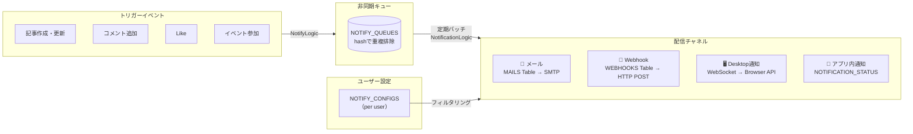
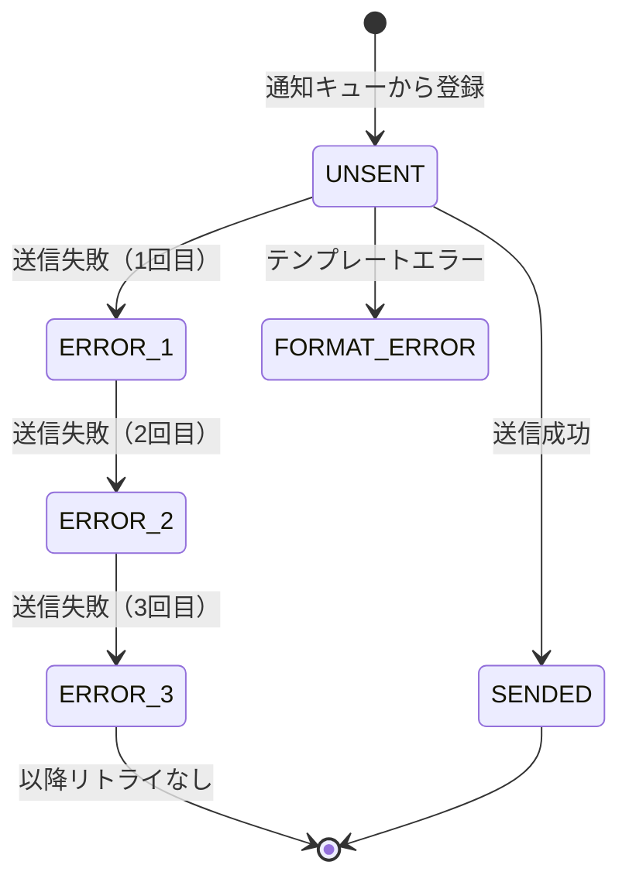
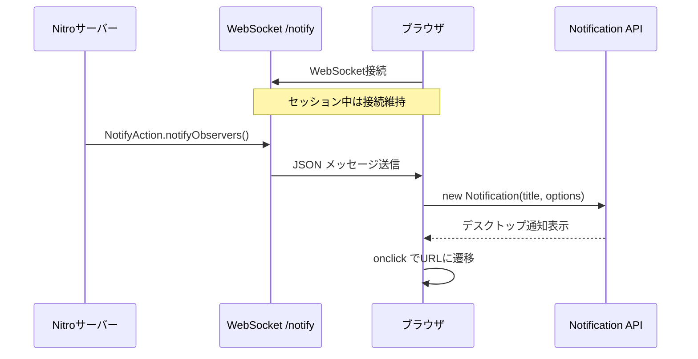
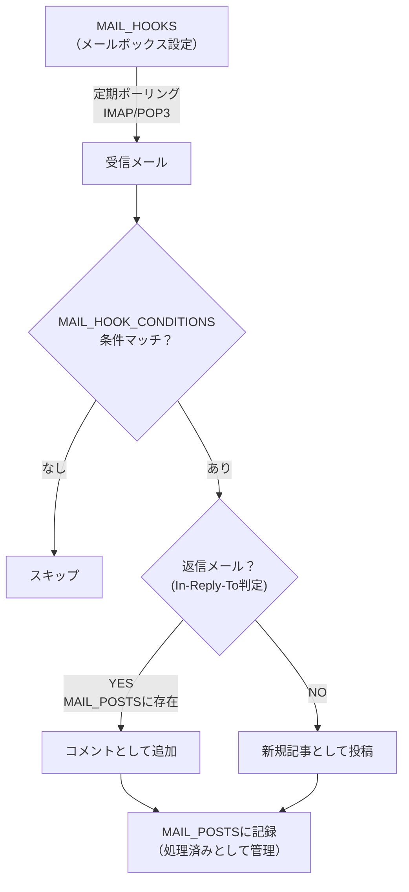

# 通知・インテグレーションシステム解析

通知システムはマルチチャネル構成（メール・Webhook・デスクトップ・アプリ内）を非同期キュー経由で配信する設計になっている。
トリガーイベント発生時は `NOTIFY_QUEUES` テーブルに登録するだけで、実際の配信は定期バッチが担う。
この分離によりリクエストのレスポンスタイムに影響を与えないが、バッチが失敗しても通知されない問題もある。

## Links

- [[00_current_system_analysis]] - 現状解析サマリ
- [[01_architecture]] - アーキテクチャ概要
- [[02_domain_model]] - 関連テーブル

---

## 通知パイプライン全体図



---

## 通知タイプ

5種類のイベントが通知のトリガーになる。各タイプで送信先（記事作成者のみ・フォロワー全員・参加者）が異なる。

| 定数 | 値 | トリガー | 通知対象 |
|------|---|---------|---------|
| TYPE_KNOWLEDGE_INSERT | 1 | 記事新規投稿 | フォロワー |
| TYPE_KNOWLEDGE_UPDATE | 2 | 記事更新 | フォロワー |
| TYPE_KNOWLEDGE_COMMENT | 11 | コメント追加 | 作成者・フォロワー |
| TYPE_KNOWLEDGE_LIKE | 21 | 記事へのLike | 作成者のみ |
| TYPE_COMMENT_LIKE | 22 | コメントへのLike | コメント投稿者のみ |

---

## メール通知

### テンプレートシステム

16種類のメールテンプレートがXMLで定義されており、日本語（ja）・英語（en）の2言語に対応している。
テンプレート変数は `{KnowledgeId}` のような形式で本文に埋め込まれ、配信時に実値に置換される。

```
MAIL_TEMPLATES
  └─ 1:N MAIL_LOCALE_TEMPLATES（テンプレートIDとロケールキーで管理）
              ├─ ja: 日本語テンプレート
              └─ en: 英語テンプレート
```

テンプレート例（コメント通知）：
```
件名: [Knowledge] Comment registered {KnowledgeId} - {KnowledgeTitle}
本文:
あなたの記事にコメントが投稿されました：{KnowledgeId}
{URL}
投稿者: {CommentInsertUser}
コメント: {CommentContents}
```

利用可能なテンプレート変数：`{KnowledgeId}`, `{KnowledgeTitle}`, `{URL}`, `{Contents}`, `{User}`, `{CommentInsertUser}`, `{CommentContents}`

### 16種類のメールテンプレート

| テンプレートID | 送信タイミング |
|-------------|-------------|
| `notify_insert_knowledge` | 記事新規投稿 |
| `notify_update_knowledge` | 記事更新 |
| `notify_insert_comment_myitem` | 自分の記事にコメント |
| `notify_insert_comment` | フォロー記事にコメント |
| `notify_insert_like_myitem` | 自分の記事にLike |
| `notify_insert_like_comment_myitem` | 自分のコメントにLike |
| `invitation` | ユーザー招待 |
| `mail_confirm` | メールアドレス変更確認 |
| `password_reset` | パスワードリセット |
| `notify_accept_user` | ユーザー承認 |
| `notify_add_user` | 管理者によるユーザー追加 |
| `notify_registration_event` | イベント参加確定 |
| `notify_add_participate` | 新規参加者通知 |
| `notify_remove_participate` | 参加者削除通知 |
| `notify_change_event_status` | イベント状態変更 |
| `notify_event` | 週次イベントダイジェスト |

### メール送信フロー

配信はリトライ付きのキューシステムで行われる。最大3回リトライし、それ以降は `FORMAT_ERROR` として停止する。



---

## Webhook連携

外部サービス（Slack等）へのHTTP POSTでリアルタイムに変更を通知する機能。
ペイロードはJSONテンプレートで定義されており、管理画面から変更可能。プロキシ設定にも対応している。

### Webhookのトリガー種別

| HOOK値 | トリガー |
|-------|---------|
| `HOOK_KNOWLEDGES` | 記事作成・更新 |
| `HOOK_COMMENTS` | コメント追加 |
| `HOOK_LIKED_KNOWLEDGE` | 記事へのLike |
| `HOOK_LIKED_COMMENT` | コメントへのLike |

### ペイロードテンプレート機能

テンプレートエンジンはシンプルなプロパティ置換方式。プロパティアクセス・日付フォーマット・文字数制限をサポートする。

```json
{
  "title": "{knowledge.title}",
  "content": "{knowledge.content,maxlength=500}",
  "status": "{knowledge.status}",
  "update_date": "{knowledge.updateDatetime,format=yyyy/MM/dd HH:mm:ss}",
  "link": "{knowledge.link}",
  "tags": "{knowledge.tags}"
}
```

---

## Desktop通知（ブラウザプッシュ）

WebSocketを使ってブラウザのNotification APIを呼び出す独自実装。
WebPush（VAPID）ではないため、ブラウザがアクティブな状態でないと通知されない。



---

## メールHook（メール→記事自動変換）

指定メールボックスをポーリングして受信メールを記事・コメントとして自動投稿する機能。
返信メール（References ヘッダ）を検出してコメントとして追加する仕組みも持つ。



条件設定（`MAIL_HOOK_CONDITIONS`）で投稿時の公開設定・タグ・閲覧者を自動適用できる。
POST_LIMITで「誰でも投稿可能」「登録ユーザーのみ」「特定ドメインのみ」を制御する。

---

## ユーザー別通知設定（NOTIFY_CONFIGS）

通知の受け取り方はユーザーごとに細かく設定できる。ただし設定の種類が多く、UXが複雑になっている。

| 設定項目 | 説明 |
|---------|------|
| NOTIFY_MAIL | メール通知の有効/無効 |
| NOTIFY_DESKTOP | デスクトップ通知の有効/無効 |
| MY_ITEM_COMMENT | 自分の記事へのコメント通知 |
| MY_ITEM_LIKE | 自分の記事へのLike通知 |
| MY_ITEM_STOCK | 自分の記事のストック通知 |
| TO_ITEM_SAVE | ストックした記事の更新通知 |
| TO_ITEM_COMMENT | ストックした記事のコメント通知 |
| TO_ITEM_IGNORE_PUBLIC | 公開記事の更新通知を無視 |

---

## 移行時の考慮点

複雑な通知システムをすべて移行するのは工数が大きい。初期スコープでは最低限の通知のみ実装し、段階的に拡張することを推奨する。

| 機能 | 移行の難度 | 推奨方針 |
|------|---------|---------|
| メール通知 | 低 | Resend等SaaSを使い実装を簡略化 |
| Webhook | 低 | Nuxt 4のAPIルートでシンプルに実装 |
| Desktop通知 | 中 | Web Push API（VAPID）に移行推奨 |
| メールHook | 高 | 複雑・低頻度のためスコープ外候補（→ [[ADR-004_feature_scope]]） |
| 通知キュー | 中 | 初期は同期処理でも可。後からBull/Inngest等でキュー化 |
