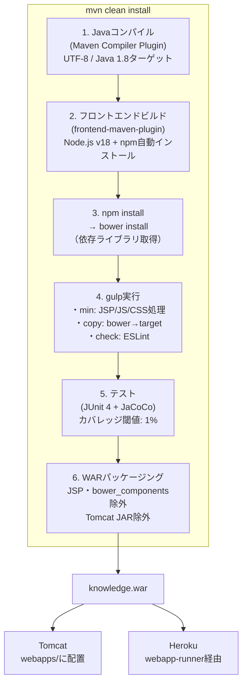
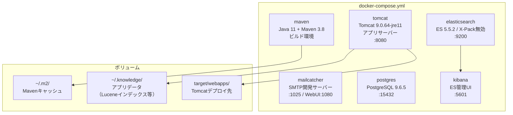
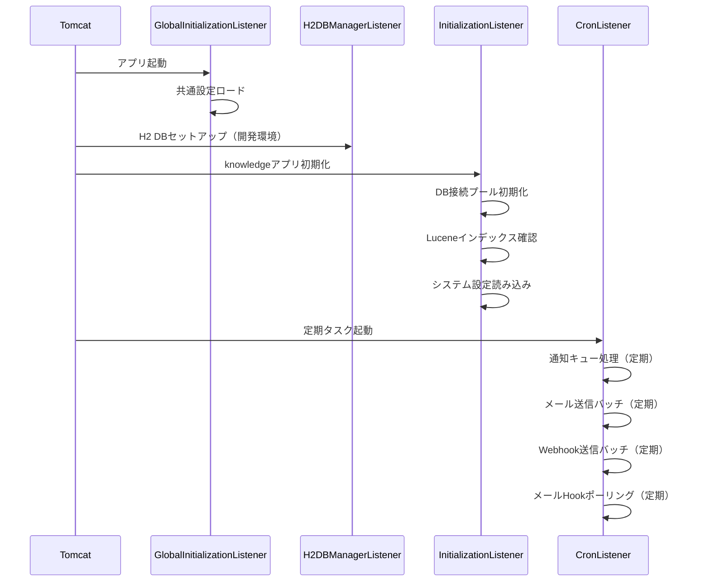

# ビルド・インフラ解析

旧システムはJavaのMavenビルドとNode.js/Gulpのフロントエンドビルドを組み合わせたハイブリッドなパイプラインを持つ。
フロントエンドの依存関係管理にBowerを使用しているが、Bower は2017年に廃止されており、現在は新規プロジェクトへの使用は推奨されていない。
デプロイ形式はTomcatへのWARファイルデプロイで、DockerとHerokuにも対応している。

## Links

- [[00_current_system_analysis]] - 現状解析サマリ
- [[01_architecture]] - アーキテクチャ概要

---

## プロジェクト基本情報

| 項目 | 内容 |
|------|------|
| Group | `org.support-project` |
| Artifact | `knowledge` |
| Version | `1.13.1-SNAPSHOT` |
| Packaging | WAR（Tomcat 8.5 へデプロイ） |
| Java Target | **1.8**（実行環境: Java 11+） |
| ライセンス | Apache 2.0 |

---

## ビルドパイプライン

JavaコンパイルとフロントエンドビルドをMavenのライフサイクルに統合している。
`prepare-package` フェーズでNode.js/Gulpが実行され、その後WARに含まれる。

### Gulpタスクの詳細

`min` タスクがメインで、JSPファイルに書かれたインラインのJS/CSSを解析してminify・ハッシュ付与・置換を行う。本番ビルドではデバッグログ出力も無効化される。

| タスク | 処理内容 |
|-------|---------|
| `min` | JSP処理・JS/CSS minify・revハッシュ付与・デバッグログ無効化 |
| `copy` | bower_componentsからMathJax・Mermaid等をtargetにコピー |
| `check` | ESLintでJSを検証（slide.jsのみ対象） |

---

## 主要依存関係

2014〜2017年代の依存関係が多く、現在のエコシステムから大きく乖離している。

| 依存 | バージョン | 用途 | 状態 |
|------|---------|------|------|
| Servlet API | 3.1.0 | Webフレームワーク基盤 | △ |
| Tomcat Embed | 8.5.91 | 実行コンテナ | △ Tomcat 10+推奨 |
| **Lucene** | **4.10.4** | 全文検索 | ❌ 2014年・現9.x |
| Apache Tika | 1.28 | ドキュメント解析 | △ |
| Apache Directory API | 1.0.0 | LDAPクライアント | △ |
| PostgreSQL Driver | 42.1.4 | 本番DB | ✅ |
| H2 Database | 1.4.196 | 開発・テスト用 | ✅ |
| OWASP HTML Sanitizer | 20171016.1 | XSS対策 | △ |
| Apache POI | 5.0.0 | Excel/Office操作 | ✅ |
| Gson | 2.10.1 | JSON | ✅ |
| JavaMail API | 1.6.0 | メール送信 | △ |
| **Bootstrap** | **3.3.6** | UIフレームワーク | ❌ 2016年・現5.x |
| **Vue.js** | **2.4.2** | リアクティブUI | ❌ EOL |
| **Bower** | 1.8.14 | フロントパッケージ管理 | ❌ 廃止済み2017年 |

---

## Docker構成

開発環境は6サービスで構成されており、全て docker-compose で起動できる。
elasticsearchとkibanaは代替検索エンジンの試験用に含まれているが、実際にはLuceneが本番実装。

---

## 起動・初期化シーケンス

4つのListenerがアプリ起動時に順番に実行され、DB接続・インデックス確認・定期タスク起動を行う。

---

## データ永続化の問題点

現在の設計ではファイルデータをDBのBYTEAに直接保存しているため、DBが肥大化しやすい。また Lucene インデックスがローカルFSにあるため、複数インスタンスへのスケールアウトができない。

| 問題 | 詳細 | 移行時の方針 |
|------|------|------------|
| ファイルをDBに保存 | `KNOWLEDGE_FILES.FILE_BINARY BYTEA` | S3互換ストレージ（MinIO等）に移行 |
| アバターをDBに保存 | `ACCOUNT_IMAGES.FILE_BINARY BYTEA` | 同上 |
| LuceneインデックスがローカルFS | クラスタ化・水平スケール不可 | Meilisearch（独立サービス）に移行 |
| H2がデフォルトDB | 本番でPostgreSQLへの切り替え設定が必要 | PostgreSQLのみに統一 |

---

## 移行時の技術対応

旧構成から新構成（Nuxt 4）への技術マッピング。

| 旧（Java/Tomcat） | 新（Nuxt 4） |
|-----------------|------------|
| Maven WAR + Tomcat | Node.js / Bun サーバー |
| Gulp + Bower | Vite（Nuxt 4内蔵） |
| Docker Compose 6サービス | Docker Compose 3サービス（app / postgres / meilisearch） |
| ファイルをDB(BYTEA)保存 | S3互換（MinIO）またはローカルストレージ |
| LuceneをローカルFSに | Meilisearch（独立コンテナ） |
| Heroku WAR | Railway / Render / Vercel等のモダンPaaS |
| Travis CI | GitHub Actions |
